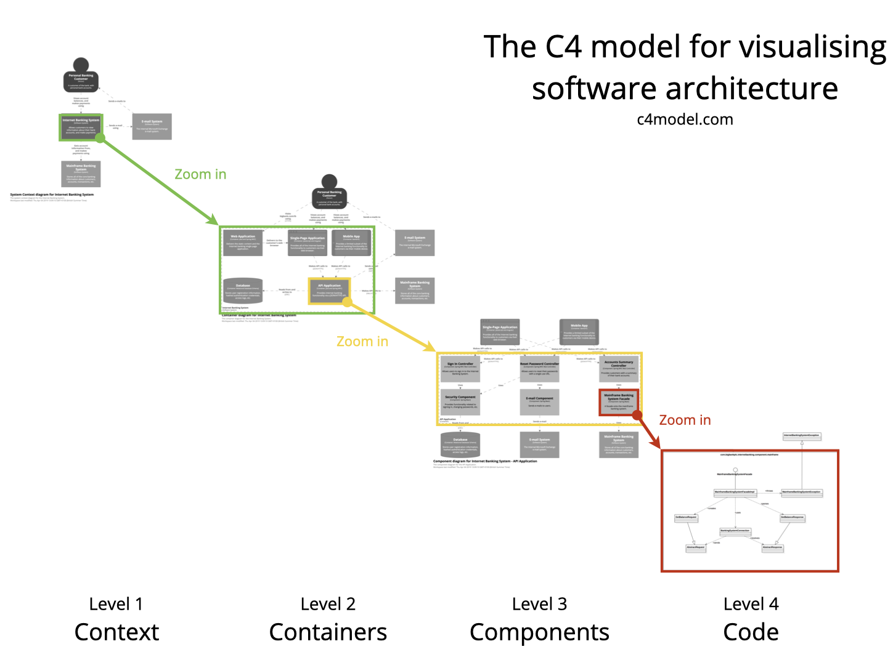

__Data architecture of a TRE with C4 modelling language__ A workshop by Joe Leach (LB Tower Hamlets Data Architect) [🌐](https://www.uktre.org/en/latest/events/wg_workshops/2023-12-05-december-meeting/workshop-tre-c4-architecture.html
)[📜](https://hackmd.io/U08T3tHXTo64WXXjqVLb4A?both)

## 📦 Dependencies

This notebook uses [structurizr-lite](https://structurizr.com/help/lite) to work with "diagrams as code" (a similar outcome, though with non-interactive diagrams, could be achieved with a combination of [quarto](https://quarto.org) and [kroki](https://kroki.io)). In either case, the use of [git](https://git-scm.com) supports effective version control.

structurizr-lite is created by the author of C4, and is possibly the best implementation as it allows you to re-render nested elements at different levels in the zoom hierarchy, this means that you only need to create elements once for use in multiple views. The tool allows zoom traversal of nested hierarchies. 

The design outputs are rendered as a website on your local machine, and enable you to open designs in "presentation mode" making the best use of available screen space. You can also export the outputs to static webpages and images.

## 🛠️ Workshop

### Summary

This workshop will run some research questions through a draft TRE design for a HDRC (Health Determinants Research Collaborative). This design exposes the interfaces between architecture and trust for regulatory control of research data management. We will demonstrate how to:

1. Run a catalogue of fresh metadata describing a network of data controllers (council and health services)
    1. Enrich metadata (e.g. by describing data quality dimensions)
1. Support reproducible analytical pipelines that run inside a TRE to
    1. Receive de-identified data from different sources, each of which has applied the same encryption key to identifiers.
      1. The encryption key is maintained by a third-party trust (e.g. another HDRC)
  1. Link de-identified records (e.g. education/housing/health)
  1. Run analyses in-place
  1. Perform statistical disclosure control
1. Output trusted analyses

You’d be forgiven for thinking this TRE sounds like a sandbox, but the special ingredient here is the **implementation of governance protocols** managing data uses at key checkpoints.

To help communicate this approach to TRE design, we have experimented with analogies such as central reference libraries and air traffic control, and will workshop some examples to round off this thought experiment.

### Preparation

Readers should be familiar with [The Goldacre Review](https://www.goldacrereview.org). Here's some of the summary recommendations: 

#### Goldacre on platforms and security

> Build ... shared <mark>Trusted Research Environments</mark> – then make these the norm for all analysis of NHS patient records ... <mark>there should be as few TREs as possible</mark>, with a strong culture of openness and re-use around all code and platforms.

#### Goldacre on purpose

>  Identify a range of 'data pioneer’ groups ... Resource them to adopt modern working practices (<mark>Reproducible Analytic Pipeline working methods in a TRE</mark> alongside research software engineer support) and to develop shared re-usable methods, code, technical documentation and tools

> <mark>Build TRE capacity by taking a hands-on approach to the components of work common to all TREs</mark>. Avoid commissioning multiple closed, black box data projects from which little can be learned, or framing these as ‘experiments’. Experimentation is only powerful where it delivers openly shared working methods, code, outputs and technical documentation from which all can learn. 

### Target audience

Colleagues from data architecture, science, engineering, and governance.

### On C4

[https://c4model.com](https://c4model.com)

#### The C4 model is...

1. A set of hierarchical abstractions (software systems, containers, components, and code).
2. A set of hierarchical diagrams (system context, containers, components, and code).
3. Notation independent. C4 is a "self-describing" model, little-to-no prior training is required to begin interpreting the diagrams!
4. Tooling independent. You can draw C4 in any tool - this session focuses on the Structurizr tools created by the author of C4 as they offer some benefits.

#### The four Cs of C4

1. Context - a system
2. Containers - the discreet elements within a system (e.g. a website is made up of a webserver and database)
3. Components - the system elements handling processes
4. Code - discreet processing functions, when applied to data architecture, this is represented as discreet elements within a data model

#### Modelling data architecture with C4

Whilst C4 visually expresses **Context**, **Container**, and **Component**, it _doesn't_ express the **Code** element; this is becacuse this language generally describes high-level perspectives in software design. 

The **Code** perspective _is_ needed for data architecture however to show data relations. In cases where the lowest level _is_ rendered, UML is used. For describing data architecture, **Entity Relation diagrams** are used here to show data relations. [kroki](https://kroki.io) is used for rendering Entity Relation Diagrams as images using either the [dbml](https://github.com/softwaretechnik-berlin/dbml-renderer) or [erd](https://github.com/BurntSushi/erd) packages 

## Diagrams

### System landscape

<mark>💡 Tip: If viewing via structurizr, you can press the "Enter Presentation Mode" button to see these diagram fullscreen</mark>

### Tracing a research question through this design

> Assessing the impact of discretionary universal free school meal schemes on primary school children’s weight status, education attainment, school absence, and healthcare utilisation: a natural experiment study in England.

### Run a catalogue of fresh metadata describing a network of data controllers (council and health services)

<mark>💡 Tip: If viewing via structurizr double-tap to zoom through element hierarchy where the <abbr title="zoomable elements">magnifying glass cursor</abbr> appears when you mouseover an element containing descendants</mark>

#### Enrich metadata (e.g. by describing data quality dimensions)

an example of the [dama uk quality dimensions](https://tennessine.co.uk/metro/323c1b048bd1e43) (see the "dama uk dimensions" line on the tube map below which guides quality improvement plans)

<!--  -->

### Support reproducible analytical pipelines that run inside a TRE

#### Receive de-identified data from different sources, each of which has applied the same encryption key to identifiers.

#### The (encrypted) encryption key is maintained by a third-party trust 

* e.g. another HDRC

### Link and analyse de-identified records (e.g. service/health records)

### Perform statistical disclosure control

### Output trusted analyses

## Bonus section: TRE analogies 

To help communicate approaches to TRE design, we have experimented with analogies such as central reference libraries (processors request, handle, and return the data in situ with the help of catalogues) and air traffic control (the ingress/egress of data and processors is continually regulated), and will workshop some examples to round off this thought experiment.

⚠️ Note: these analogies were fleshed out with assistance from a large language model, those familiar with LLMs like chatgpt will recognise their ability for generating lists of associations. Nonetheless, all content has received input from real neural networks too!

### 🏛️ Reference library TRE analogy 📚

Imagine a trusted research environment as a reference library. Researchers are able to request information access within the confines of the library. The staff ensure that all materials are carefully curated and accessed.

**Curated Collection**: The library's collection is curated to include only reputable and trustworthy sources. Similarly, data and information are of reliable provenance.

**Librarian Oversight**: Librarians in the reference library oversee the collection, assisting researchers in finding relevant materials and guiding them on the best sources. Similarly, a trusted research environment has administrators who oversee the processes taking place within, providing guidance and ensuring adherence to professional standards.

**Access Controls**: Access to certain sections of the library may be restricted to authorised individuals. Similarly, access controls are implemented to ensure that only authorised researchers can access sensitive data, protecting the privacy and security of the information.

**Quality Assurance**: Books and journals in the library undergo a quality assurance process to ensure accuracy and reliability. data undergoes rigorous validation and verification processes to maintain high-quality standards.

**Credible Citations**: Researchers in the library rely on credible citations to build upon existing knowledge. Similarly, researchers use validated data and cite reputable sources to establish the credibility of their findings.

**Ethical Guidelines**: The library operates within ethical guidelines, respecting copyright laws and intellectual property rights. researchers adhere to ethical standards, obtaining proper permissions and ensuring the responsible use of data.

**Collaboration Spaces**: Libraries often provide collaborative spaces where researchers can work together. collaborative platforms allow researchers to share and collaborate on data while maintaining the integrity and security of the information.

**Documentation and Cataloging**: The library meticulously documents and catalogs its collection for easy retrieval. Similarly, thorough documentation and metadata are maintained to track the origin, usage, and modifications of data for transparency and reproducibility.

Just as a reference library is a reliable hub for researchers seeking accurate information, a trusted research environment serves as a secure and controlled space for researchers to access and work with validated data for scientific inquiry.

### 🛂 Air traffic control TRE analogy 🚦

The governance of inbound/outbound people, processes, and records in a TRE has some similarities with the way Air Traffic Controllers coordinate the ingress/egress of travelling people and materials.

**Central Oversight**: There is a central hub oversight of a far-reaching network, ensuring that data access, usage, and research activities are conducted within ethical and legal boundaries.

**Approved plans**: Researchers may need approval for their research plans, ensuring that they adhere to ethical standards, legal requirements, and data access protocols.

**Restricted Access**: There are restricted access spaces for data, maintaining the separation between reseach investigations.

**Communication Protocols**: There are communication protocols and guidelines for researchers to interact with librarians/administrators and share information responsibly.

**Validation Checks**: Data undergoes validation and verification processes to ensure accuracy, reliability, and compliance with research standards.

**Clearance for sharing**: Researchers may need clearance or approval for concluding their research, ensuring that the results meet the necessary standards and ethical considerations and tha statistical disclosure controls have been correctly applied.

**Traffic Management**: Administrators manage data traffic, ensuring that researchers can access and share information without compromising security or integrity.

**Emergency Response**: Protocols exist for handling data breaches or ethical concerns.

**Training and Certification**: Researchers receive training on data handling, governance requirements, and compliance with regulations to ensure responsible research conduct.

**Logging**: Data logs and records that capture the history and usage of information for transparency, accountability, and reproducibility.

By drawing parallels with an air traffic control system, the concept of a trusted research environment emphasises the importance of governance in overseeing research to ensure responsible and secure research practices.

---
🏁 You have reached the end, thanks for reading 🏁